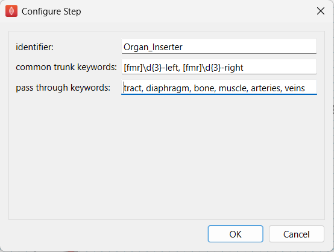

.. _mcp-organinserter-configuration:

Configuration
-------------

This step comes with pre-configured settings as shown in :numref:`fig-organ-inserter-configuration-initial`.

.. _fig-organ-inserter-configuration-initial:

  Organ Inserter configuration dialog just after loading.

The configuration dialog lets users define case-insensitive keywords found in the input organ scaffold (and template scaffold) filenames to determine which insertion mode is applied. While a comprehensive set of keywords is already pre-configured, users can adjust them if needed. For example, the common trunk keywords are pre-set with regex expressions that detect vagus scaffold files following a standard naming convention: an alphabet (`M`, `F`, or `r`), followed by three digits, and `-left` or `-right`. If both the common trunk and pass-through keyword fields are left empty, input organ scaffolds will be inserted using the default mode.
