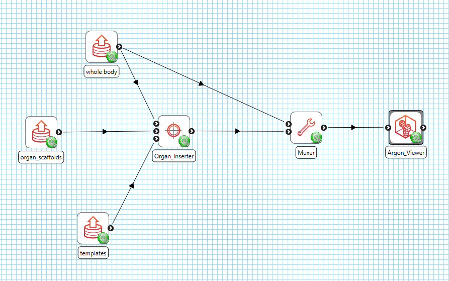

.. _mcp-organinserter-workflow-setup:

Workflow Setup
--------------

To setup an **Organ Inserter** workflow, add a **File Chooser** step (or another step that provides a `Zinc` whole body scaffold EX file), a **Multiple File Chooser** step and the **Organ Inserter** step to the workflow area.

Edit the **File Chooser** step configuration to specify the `Zinc` EX file that contains the whole body scaffold. Once this step has been configured, connect its output port to the first input port of the
**Organ Inserter** step - as in :numref:`fig-organ-inserter-workflow`.

Next, configure the **Multiple File Chooser** to specify the `Zinc` EX files for the organ scaffolds to be inserted into the whole body scaffold. Connect its output port to the second input port of the **Organ Inserter** step.

If any of the organ scaffolds are to be inserted via the common trunk mode, you will also have to add another **Multiple File Chooser** step and configure it to pass the `Zinc` EX files for template organ scaffolds. Connect the output port for this second **Multiple File Chooser** step to the third input port of the **Organ Inserter** step.

What you connect the **Organ Inserter** step output port to depends on your objective. In :numref:`fig-organ-inserter-workflow`, we have connected the output port to a **Muxer** step - allowing us to supply the output files from **Organ Inserter** step and the whole body scaffold to **Argon Viewer** for visualisation purposes.

.. _fig-organ-inserter-workflow:

  Organ Inserter workflow connections.

Once we have the workflow set up, save it and click the `Execute` button to start the **Organ Inserter** workflow.

